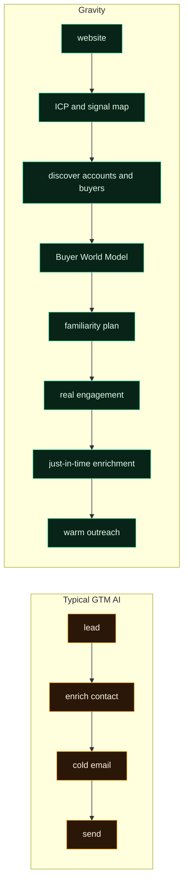
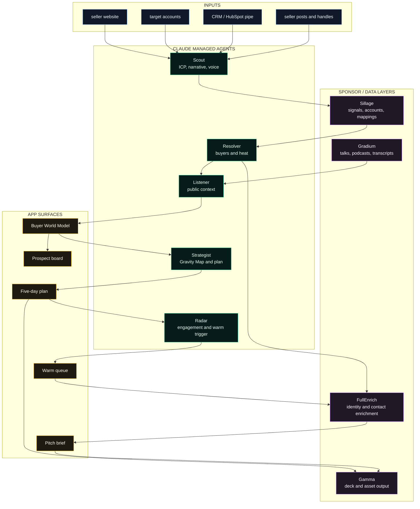
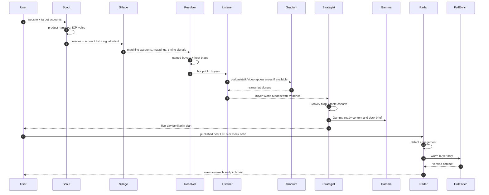
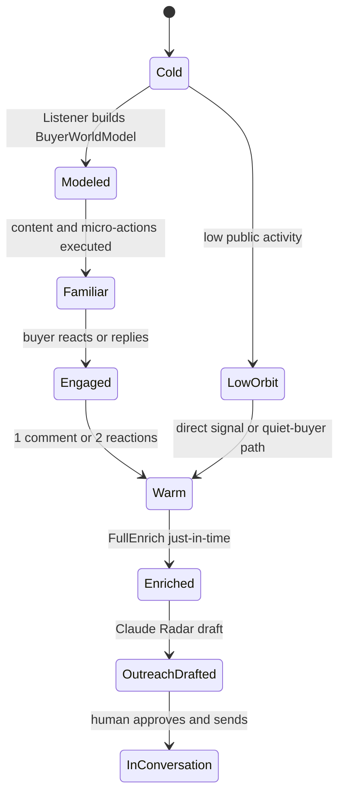
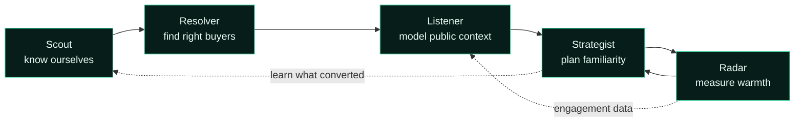
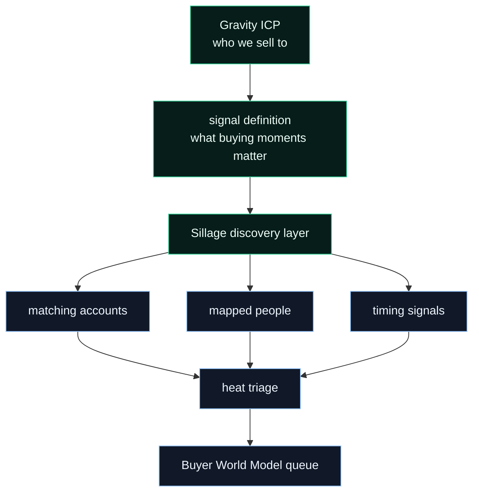
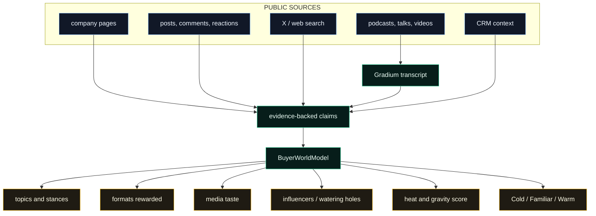
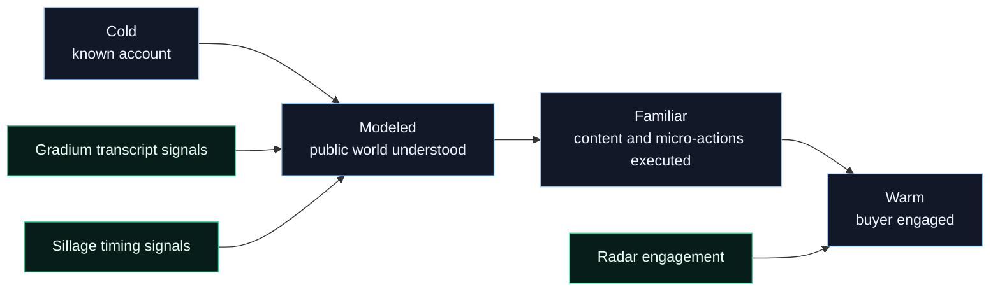
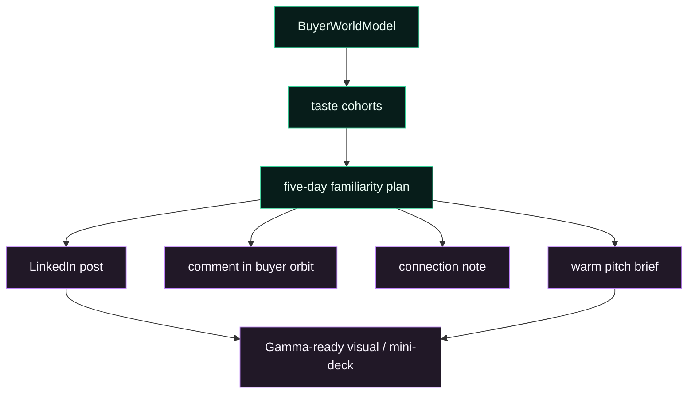
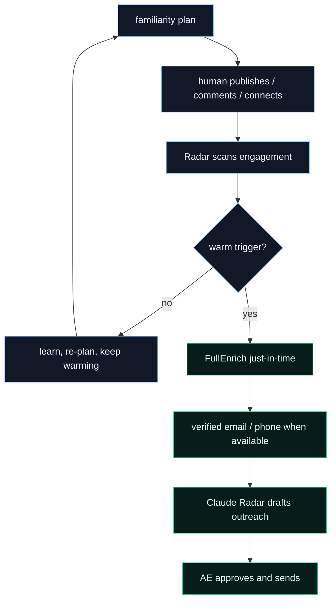

# Gravity

> Build enough relevance that your buyers discover you before you discover them.

Gravity is a GTM agent that builds familiarity before outreach. Instead of
starting with "find a lead, enrich a contact, generate a cold email, send it,"
Gravity starts earlier: it maps the public information bubble around target
buyers, creates content and micro-actions that put your company inside that
bubble, and only drafts outreach once the buyer engages.

Presenter line:

> **Gravity makes outreach warm before it is sent.**

Most GTM tools automate the message. Gravity automates the path before the
message.

See it: paste a website, load target accounts, watch the Claude managed agents
build buyer world models, approve a five-day familiarity plan, scan engagement,
and see one buyer flip Warm before FullEnrich runs.

```bash
npm install
GRAVITY_MOCK=1 npm run dev
# http://localhost:3000
```

---

## Table Of Contents

- [Why Gravity](#why-gravity)
- [What Is Built](#what-is-built)
- [Presenter Walkthrough](#presenter-walkthrough)
- [General Architecture](#general-architecture)
- [Claude Managed Agents](#claude-managed-agents)
- [Signal Discovery With Sillage](#signal-discovery-with-sillage)
- [Buyer World Models](#buyer-world-models)
- [Content And Presentation Layer](#content-and-presentation-layer)
- [Warm Trigger And FullEnrich](#warm-trigger-and-fullenrich)
- [Demo Data](#demo-data)
- [Customer Lead Research](#customer-lead-research)
- [Technology Stack](#technology-stack)
- [Configuration](#configuration)
- [Getting Started](#getting-started)
- [Testing](#testing)
- [Ethics](#ethics)

---

## Why Gravity

Most GTM AI tools start with the same workflow:

1. find a lead;
2. enrich the contact;
3. generate a cold email;
4. send it.

Gravity starts earlier.

The missing step in modern outbound is familiarity: being recognized before the
ask. Every buyer lives inside an information bubble: people they follow, posts
they engage with, formats they trust, communities they belong to, podcasts they
appear on, and proof points they reward.

Gravity maps that bubble and builds a path into it.



The core claim:

> Everyone else automates cold outreach. Gravity automates becoming a familiar
> name before the outreach ever happens.

## What Is Built

| Surface | What it does | Status |
|---|---|---|
| Website-to-ICP Scout | Reads the seller website and produces product narrative, ICP, voice, and buyer personas | Built |
| Claude managed agent crew | Scout, Resolver, Listener, Strategist, and Radar coordinate the GTM loop | Built |
| Sillage account setup | Pushes ICP and account list into Sillage REST path when keys exist | Built |
| Sillage signal story | Uses Sillage as the discovery layer for timing, accounts, mappings, and buying moments | Built / graceful fallback |
| FullEnrich identity search | Finds named buyers when live keys exist | Built / mocked |
| Buyer World Model schema | One evidence-backed model read by board, plan, warm queue, and pitch brief | Built |
| Evidence drawer | Every topic/stance/influencer claim has URLs | Built |
| Gradium spoken-web layer | Finds/transcribes public talks or podcasts and mines them for taste signals | Built / key gated |
| Gravity Map | Synthesizes shared buyer conversations and taste cohorts | Built |
| Five-day familiarity plan | Posts, comments, follows, connects, and proof assets before outreach | Built |
| Radar engagement scan | Scripted stage scan and live Apify post-engagement scan | Built |
| Warm queue | Triggers when buyer comments once or reacts twice | Built |
| FullEnrich just-in-time contact | Buys contact data only after warmth | Built / mocked |
| Gamma-ready pitch brief | Creates a compact deck outline and opens Gamma for asset creation | Built |
| Live LinkedIn auto-actions | Not shipped; intentionally human-in-the-loop | Not built |
| Gamma API deck creation | Planned direct integration; current build creates Gamma-ready briefs/assets | Roadmap |

## Presenter Walkthrough

The demo should be opened directly on the deterministic cached workspace:

```bash
GRAVITY_MOCK=1 npm run dev
```

| Time | Screen | Presenter line |
|---|---|---|
| 0:00-0:20 | Input | "Most GTM tools start by finding a lead, enriching a contact, and writing a cold email. Gravity starts earlier." |
| 0:20-0:45 | Agent board | "Claude managed agents read our website, build the ICP, define the signal map, and discover the right accounts." |
| 0:45-1:10 | Buyer world model | "Every recommendation has evidence: public posts, websites, signals, spoken-web context, and source URLs." |
| 1:10-1:35 | Gravity plan | "Instead of five cold emails, we get a five-day familiarity plan: what to post, where to comment, who to connect with, and when to reach out." |
| 1:35-1:55 | Warm queue | "Radar detects engagement. Only now does FullEnrich run. The AE gets contact data and a draft based on real engagement." |
| 1:55-2:00 | Close | "Gravity makes outreach warm before it is sent." |

Full script:

> Most GTM tools start with the same workflow: find a lead, enrich the contact,
> generate a cold email, and send it.
>
> Gravity starts earlier.
>
> In this demo, I begin by pasting our company website into Gravity. Claude
> managed agents read the website and build our ICP: who we sell to, what pain
> we solve, what language we use, and which buyer personas matter.
>
> Now we define the signals we care about. These can be classic GTM signals
> like job changes, promotions, hiring intent, alumni networks, mutual
> connections, or competitor engagement. But they can also be niche artifacts:
> a podcast someone appeared on, a blog they wrote, a community they belong to,
> or a specific habit that reveals how they think.
>
> This is where Sillage comes in. We use Sillage as the discovery layer.
> Gravity tells Sillage what signal to search for, and Sillage helps us find
> the people and accounts matching that buying moment.
>
> Then the Claude managed agents coordinate the workflow. Scout understands our
> ICP. Resolver identifies the right buyers. Listener studies their public
> context. Strategist builds a buyer taste profile: tone, interests, trust
> triggers, proof points, and content preferences. Radar watches for engagement
> and decides when an account is becoming warm.
>
> Instead of generating five cold emails, Gravity creates a five-day familiarity
> plan: what to post, where to comment, who to connect with, and when to reach
> out. Gamma turns the strategy into content and presentation assets. Gradium
> brings spoken-web signals into the account journey. FullEnrich runs only when
> a buyer is warm.
>
> Finally, Claude drafts outreach based on real engagement, not fake
> personalization.

---

## General Architecture

Gravity is a staged agent pipeline. The current repo can run entirely from
fixtures for a reliable live demo, and each external layer switches on when keys
are present.



### Data flow



### State machine



---

## Claude Managed Agents

Gravity uses Claude managed agents through the Anthropic Agent SDK. The crew can
run with `ANTHROPIC_API_KEY` or a Claude subscription login, and falls back to
fixtures for the stage demo.

| Agent | Goal | Inputs | Output | Eval |
|---|---|---|---|---|
| Scout | Understand the seller before any targeting decision | Website, CRM pipe, own posts, target accounts | Product narrative, ICP, tone, signal plan | Plain ICP, no marketing gloss, no invented capability |
| Resolver | Identify the right buyers and decide who is worth modeling | Sillage mappings, FullEnrich people search, target list | Buyer candidates, heat, low-orbit split | Contact data waits unless warm or low-orbit path requires it |
| Listener | Build evidence-backed Buyer World Models | Public web/social data, Gradium transcripts, signals | Topics, stances, formats, influencers, media taste | No claim without evidence URLs |
| Strategist | Turn buyer models into a path to familiarity | BuyerWorldModels, Company Brain, Gravity Map | Taste cohorts, five-day plan, posts, comments, connection notes | Their format, our voice, evidence-backed, no slop |
| Radar | Measure engagement and trigger warmth | Published post URLs, Apify engagement, scripted demo beats | Warm queue, JIT enrichment request, outreach draft | Outreach references real engagement naturally |



Important implementation detail: Strategist and Radar use the writing model for
human-facing words, while Scout and Listener use stronger reasoning for
distillation and modeling. Every generated draft passes an eval gate before the
UI shows it as ready.

---

## Signal Discovery With Sillage

Sillage is Gravity's discovery layer. Gravity does not just ask for "more
leads." It defines the buying moments that matter, then uses Sillage to find
accounts and people around those moments.

Signals can be broad:

- job changes;
- promotions;
- hiring intent;
- alumni networks;
- mutual connections;
- competitor engagement;
- leadership changes;
- funding or expansion events.

They can also be niche:

- a podcast appearance;
- a blog post;
- a community membership;
- a repeated content habit;
- an event talk;
- a public quote that reveals how the buyer thinks.



Implemented paths:

- REST: `PUT /api/v2/persona`
- REST: `POST /api/v2/top-account-list/accounts`
- REST: company mapping paths for account-to-people discovery
- MCP: available behind `SILLAGE_MCP=1` for interactive venue use

When Sillage keys are missing, Gravity uses cached fixture signals so the demo
does not block.

---

## Buyer World Models

The Buyer World Model is the central shared schema. It is read by the board,
the plan, the warm queue, the pitch brief, and the evaluation layer.



### What Gradium does

Gradium is used in the listening layer for the "spoken web." If a prospect has
public talks, podcasts, conference videos, or interviews, Gravity can transcribe
those appearances and turn them into buyer-world evidence: trust triggers,
language, objections, proof standards, and themes.

Those signals feed the account journey score:



---

## Content And Presentation Layer

Gravity does not stop at a recommendation. Strategist turns the model into a
five-day familiarity plan:

- what to post;
- where to comment;
- which buyer cohort the content targets;
- which proof format should land;
- when to connect;
- when to reach out.

Gamma is the end-of-pipeline asset layer. Gravity produces Gamma-ready briefs
and content outlines so the seller can turn strategy into posts, mini-decks,
visuals, sales assets, and per-lead pitch narratives.



Current implementation:

- built: pitch brief text ready to paste into Gamma;
- built: `gamma deck` link from the warm queue;
- roadmap: direct Gamma API deck generation.

---

## Warm Trigger And FullEnrich

Gravity does not buy contact data up front. It waits until the buyer creates a
reason to contact them.

Warm trigger rules:

- one comment; or
- two reactions.



The resulting email is not fake personalization. It references the real
engagement:

> "Saw your comment on workflow trust. That is exactly the point Gravity models
> before outreach..."

---

## Demo Data

The cached demo uses five public company accounts represented in the room.
Person names and roles come from the hackathon roster provided to the team;
company claims come from public company sources. Placeholder contacts use
reserved `.example` emails so the demo never implies private scraping.

| Account | Website | Demo buyer | Buyer world | Stage moment |
|---|---|---|---|---|
| Gamma | `https://gamma.app/` | Olivia Frenkel, GTM | Product-led demos, visual storytelling, mini-decks | Buyer reacts twice and flips Warm |
| Nabla | `https://www.nabla.com/` | Margaux Benoit, GTM Director | Workflow trust, clinical proof, healthcare adoption | Buyer comments "workflow trust is the real bottleneck" |
| Airtable | `https://www.airtable.com/` | Vincent Gonnot, RVP EMEA | Enterprise AI inside governed workflows | Source-trail operating-system post |
| Foundever | `https://foundever.com/` | Virginie Dupin, CMO | Human signal, brand trust, global CX | Trust and human-in-the-loop content |
| Edenred | `https://www.edenred.com/` | Christa Dabilly, RevOps stack | CRM hygiene, attribution, governance | Quiet RevOps buyer path |

Deep fixture data lives in [`data/fixtures.ts`](data/fixtures.ts).

Default target domains:

```ts
["gamma.app", "nabla.com", "airtable.com", "foundever.com", "edenred.com"]
```

## Customer Lead Research

The branch also includes customer-side lead research for the judge/mentor
companies. These are potential customers for those companies, not internal
stakeholders.

- Human review doc: [`docs/customer-lead-research.md`](docs/customer-lead-research.md)
- Code-ready export: [`data/customer-leads.ts`](data/customer-leads.ts)

Example:

```text
Nabla -> Mayo Clinic, AP-HP, CHU de Nantes, Eric Topol, Robert Wachter
Photoroom -> Shopify, Etsy, Faire
Airtable -> Decathlon, BlaBlaCar, Back Market
FullEnrich -> Lovable, Mistral AI, Mercor
```

---

## Technology Stack

| Layer | Technology | Role |
|---|---|---|
| App | Next.js 15, React 19, TypeScript | Demo UI and API routes |
| Agent runtime | Anthropic Agent SDK | Claude managed agents |
| Reasoning | Claude direct API or managed subscription auth | ICP, world models, plans, outreach |
| Signal discovery | Sillage REST and optional MCP | Persona, target accounts, company mappings, GTM signals |
| Contact data | FullEnrich API | People search and just-in-time enrichment |
| Spoken web | Gradium | Transcribe public talks/podcasts into taste signals |
| Engagement scan | Apify LinkedIn actors, X tools | Post engagement and public activity |
| Asset output | Gamma-ready pitch brief | Presentation and mini-deck workflow |
| Persistence | JSON file in `data/runtime` | Hackathon-grade deterministic state |
| Demo fixtures | `data/fixtures.ts` | Reliable stage path with no live API dependency |

---

## Configuration

The app works without provider keys by using cached fixtures. Keys unlock live
layers independently.

| Variable | Enables |
|---|---|
| `GRAVITY_MOCK=1` | Forces deterministic stage demo |
| `ANTHROPIC_API_KEY` | Claude direct API calls |
| `CLAUDE_CODE_OAUTH_TOKEN` | Claude subscription-backed managed crew |
| `SILLAGE_API_KEY` | Sillage REST persona/accounts/company mappings |
| `SILLAGE_MCP=1` | Optional Sillage MCP for interactive venue use |
| `FULLENRICH_API_KEY` | Live people search and warm contact enrichment |
| `GRADIUM_API_KEY` | Audio transcription for public talks/podcasts |
| `APIFY_TOKEN` | Live LinkedIn post/activity scans |
| `XAI_API_KEY` | Web/X discovery for public appearances and X search |
| `HUBSPOT_TOKEN` | CRM pipe as input |

---

## Getting Started

```bash
npm install
GRAVITY_MOCK=1 npm run dev
```

Open <http://localhost:3000>.

Recommended click path:

1. Paste or keep the default website.
2. Load the five cached target accounts.
3. Open `/board` and inspect the buyer world models.
4. Open `/plan` and show the five-day familiarity plan.
5. Open `/warm` and click `scan engagement`.
6. Show Margaux or Olivia flipping Warm.
7. Show FullEnrich just-in-time and the Gamma-ready pitch brief.

---

## Testing

```bash
npm run test:mock
npm run build
```

`npm run test:mock` starts a local Next.js server, runs the deterministic
pipeline, scans scripted Radar engagement, verifies warm queue behavior, and
checks plan updates.

---

## Ethics

Gravity is built around data minimization:

- public signals only;
- no private likes;
- no LinkedIn auto-actions;
- humans approve posts, comments, connection notes, and emails;
- contact data is purchased only after intent to contact;
- every buyer-world claim has evidence URLs;
- demo contact emails use reserved `.example` placeholders.

This is a relevance engine, not a surveillance engine.

---

## Credits

Sponsor APIs: [Anthropic Claude](https://www.anthropic.com) ·
[Sillage](https://www.getsillage.com/) · [FullEnrich](https://fullenrich.com/) ·
[Gradium](https://gradium.ai/) · [Gamma](https://gamma.app/).

Team: [@slaviquee](https://github.com/slaviquee) ·
[@gibouu](https://github.com/gibouu) ·
[@gderamchi](https://github.com/gderamchi).
